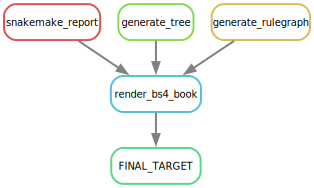

# Data Tidying

```{r, include=FALSE}
knitr::opts_chunk$set(
  echo  =TRUE,
  message  =FALSE,
  warning  =FALSE,
  cache  =FALSE,
  comment  =NA)
```

## General snakemake workflow 

<br>



A tentative snakemake workflow that defines **data processing rules** in a DAG (directed acyclic graph) format. 
A detailed interactive snakemake HTML report is available [here](https://complexdatainsights.com/imap/imap-data-processing/report.html). Use a wider screen to get a better interactive snakemake report.

<br>

## Data Tidying
Requires:

- Sample metadata
- OTU tables from `mothur` and `qiime2` pipelines.
- Taxonomy tables from `mothur` and `qiime2` pipelines.

<br>

## Microbiome composite R objects

Requires:

- Tidy sample metadata.
- Tidy OTU tables.
- Tidy taxonomy tables.

The `mothur` and `qiime2` composite objects are in a long-format which is suitable for most types of data visualization.

<br>

## Microbioma phyloseq objects
Requires:

- A `phyloseq` package
- Tidy sample metadata.
- Tidy OTU tables.
- Tidy taxonomy tables.

<br>

## Data transformation
Requires:

- A `phyloseq` package
- A `microbiome` package
- Phyloseq objects

Data transformation is intended to converting the values into ready-to-use matrices. 
There are different methods out there, and here are just a few:

- No transformation is similar to raw abundance.
- Compositional version or relative abundance.
- Arc sine (asin) transformation.
- Z-transform for OTUs.
- Z-transform for Samples.
- Log10 transformation.
- Log10p transformation,
- CLR transformation.
- Shift the baseline.
- Data Scaling.

<br>

## Data reduction
Dimensionality reduction is intended to reduce the dimension of the variables but keeping as much of the variation as possible. , and includes: 

1. Linear methods (commonly used in microbiome data analysis)
    - PCA (Principal Component Analysis)
    - Factor Analysis
    - LDA (Linear Discriminant Analysis)
    - More [here.](https://towardsdatascience.com/dimensionality-reduction-for-machine-learning-80a46c2ebb7e)
2. Non-linear methods


