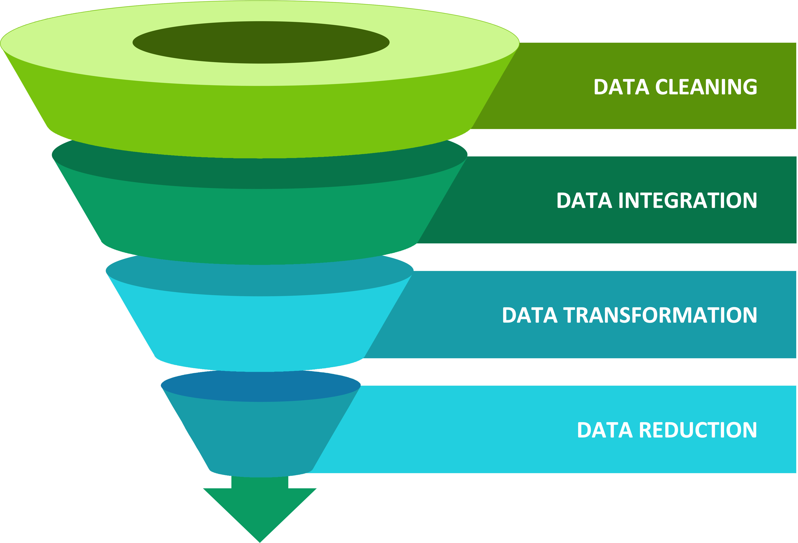

--- 
title: "<big>IMAP:</big> Integrated Microbiome Analysis Pipelines"
permalink: /imap-overview/
subtitle: "End-to-End Practical User Guides Using Integrated Approaches"
date:
- <b>2024-04-15</b>
author: Teresia Mrema-Buza
site: bookdown::bookdown_site
documentclass: book
css: style.css
csl: 
  - library/apa.csl
bibliography:
  - library/packages.bib
  - library/references.bib
  - library/imap.bib
citation_package:
  - natbib
  - biblatex
  - amsplain
url: https://tmbuza.github.io/imap-data-preparation/
cover-image: images/planning.png
email_address: "ndelly@gmail.com"
github-repo: tmbuza/imap-data-preparation
biblio-style: apalike
description: |
  | This part will be added before release.
---

<!-- # Google fonts -->
<link rel="preconnect" href="https://fonts.googleapis.com">
<link rel="preconnect" href="https://fonts.gstatic.com" crossorigin>
<link href="https://fonts.googleapis.com/css2?family=Anton" rel="stylesheet">
<link href="https://fonts.googleapis.com/css2?family=Roboto:wght@100;300;400;500;700,900&display=swap" rel="stylesheet">
<link href="https://fonts.googleapis.com/css2?family=Oswald:wght@300;400;700&display=swap" rel="stylesheet">
<link href="https://fonts.googleapis.com/css2?family=Merriweather:wght@300;400;700&display=swap" rel="stylesheet">
<link href="https://fonts.googleapis.com/css2?family=Montserrat:wght@100;200;300;400;700&display=swap" rel="stylesheet">

<!-- # CSS -->
<link rel="stylesheet" href="https://cdnjs.cloudflare.com/ajax/libs/font-awesome/5.15.3/css/all.min.css">
<link rel="stylesheet" href="https://cdnjs.cloudflare.com/ajax/libs/animate.css/4.1.1/animate.min.css">

# <u>IMAP-Part 07</u>:  Microbiome Data Preparation Guide {-#data-preparation}

 

 

## Welcome to chapter 7 {-}

Microbiome research employs high-throughput sequencing to explore microbial communities across diverse environments. This project focuses on preparing and visualizing microbiome data generated from the Mothur and QIIME2 pipelines. The dataset comprises an OTU table, taxonomic assignments, and metadata. This comprehensive guide is tailored for researchers and analysts engaged in microbiome studies, providing essential insights and methodologies for adequate data preparation. Assuming that the bioinformatics analysis phase has been successfully completed and you now possess the output or features tables, including Operational Taxonomic Unit (OTU) tables, taxonomy tables, and a metadata table, from platforms such as Mothur or QIIME2, this guide will lead you through the crucial steps of refining and optimizing your microbiome data.

## What to Expect {-}

Before diving into the details, let's take a look at what you can expect from this guide:

>- **Step-by-Step Instructions:** Each section of this guide presents clear and concise step-by-step instructions, ensuring seamless follow-through.
>  
>- **Best Practices:** Discover best practices for data cleaning, transformation, and integration, emphasizing optimization of your microbiome datasets for robust analysis.
>  
>- **Practical Insights:** Beyond technical instructions, the guide offers practical insights to navigate nuanced decisions in data preparation, empowering informed choices aligned with your research goals.

Whether you’re venturing into microbial communities for the first time or seeking advanced strategies to refine your microbiome data, this guide is your companion. Your commitment to data preparation will be pivotal in extracting meaningful biological insights and contributing to the advancement of microbiome research.

Let’s dive in!

